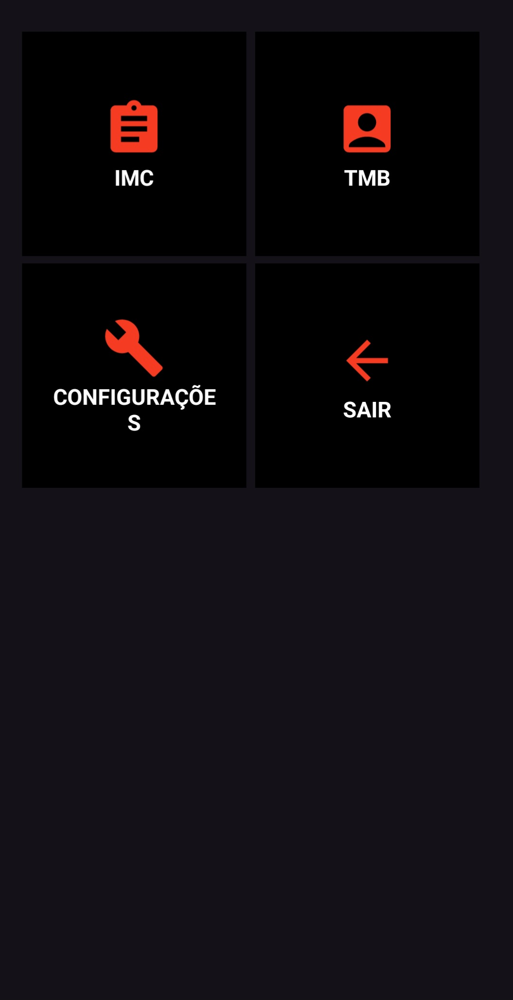
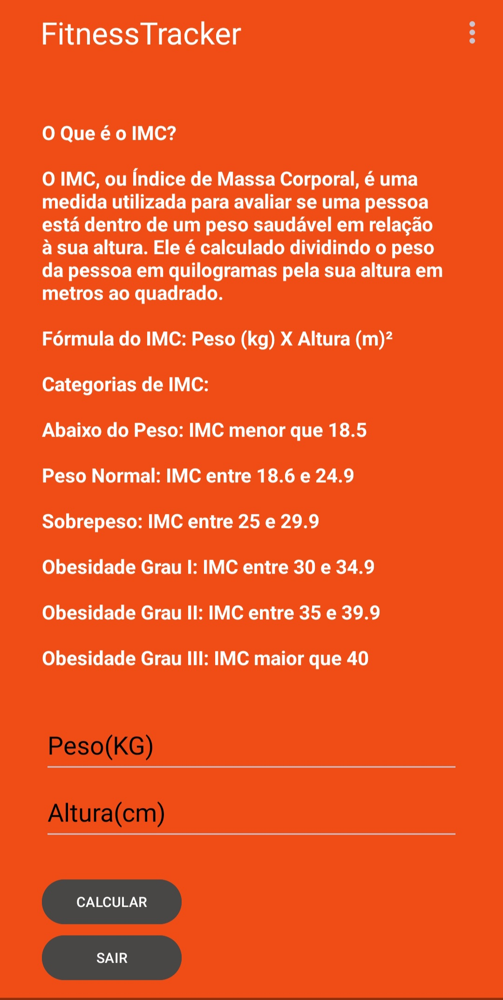
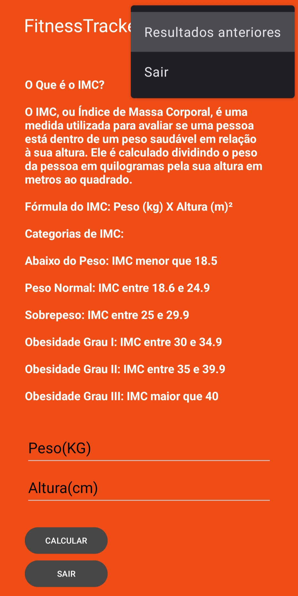

# FitnessTracker

Este aplicativo foi desenvolvido para facilitar os cálculos e o acompanhamento do Índice de Massa Corporal (IMC) e da Taxa Metabólica Basal (TMB).

## Funcionalidades

- **Tela Principal:** Navegação fácil para as telas de cálculo de IMC e TMB.
  
- **Tela de IMC:**
  - **Calcular IMC:** Insira peso e altura para calcular o IMC.
  - **Resultados Anteriores:** Visualize uma lista dos cálculos de IMC anteriores.
    
    
- **Tela de TMB:**
  - **Calcular TMB:** Insira peso, altura, idade e gênero para calcular a TMB.
  - **Resultados Anteriores:** Visualize uma lista dos cálculos de TMB anteriores.

## Tecnologias Utilizadas

- Kotlin
- Android Studio

## Como Instalar e Usar

1. Clone este repositório:
    ```bash
    git clone https://github.com/rdsbojac/FitnessTracker.git
    ```
2. Abra o projeto no Android Studio:
    - Clique em `File > Open` e navegue até o diretório onde você clonou o repositório.
    - Selecione a pasta do projeto e clique em `OK`.

3. Instale as dependências:
    - O Android Studio cuidará de instalar as dependências necessárias quando você sincronizar o projeto.

4. Compile e execute o aplicativo:
    - Clique no botão de play (`Run`) na barra de ferramentas do Android Studio para compilar e executar o aplicativo em um dispositivo ou emulador.

## Contribuição

1. Faça um fork deste repositório.
2. Crie uma branch para sua feature ou correção de bug (`git checkout -b feature/nome-da-feature`).
3. Commit suas mudanças (`git commit -m 'Adicionei uma nova feature'`).
4. Faça um push para a branch (`git push origin feature/nome-da-feature`).
5. Abra um Pull Request.

